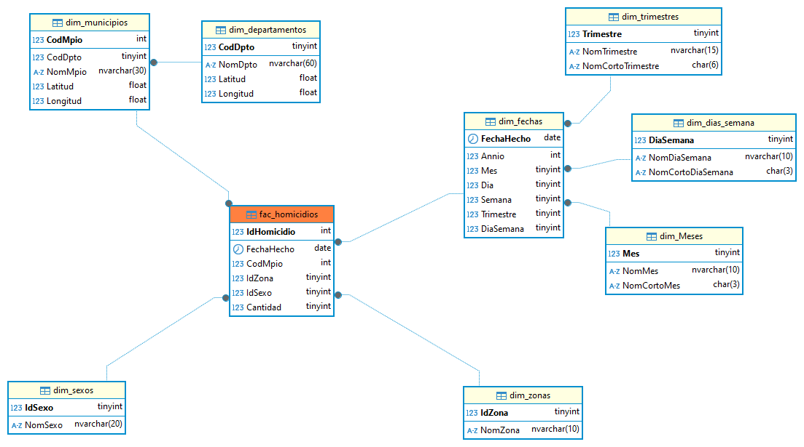

# DATAWAREHOUSE
Es un sistema que almacena datos de diferentes fuentes en un único lugar, preparado para análisis y toma de decisiones, en este apartado encontraremos los DDL provistos en la ordenación de los datos de nuestro datalake
## Relación Copo de Nieve.

